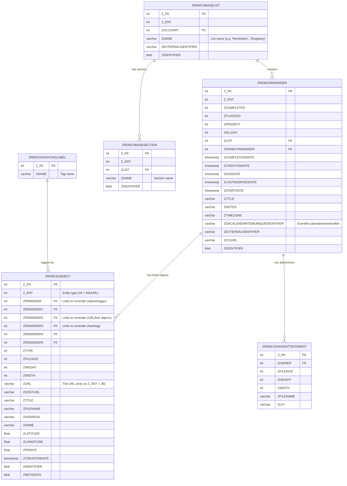

# Apple Reminders Database Schema

The Reminders app stores data in SQLite databases at:
```
~/Library/Group Containers/group.com.apple.reminders/Container_v1/Stores/Data-<UUID>.sqlite
```

Multiple databases may exist (one per account — iCloud, local, work, etc.).

## Why Direct DB Access?

EventKit does not expose the URL/link field that Reminders.app displays. The URL is stored
in the `ZREMCDOBJECT` table as a linked object (entity type 26). This is the only way to
read reminder URLs programmatically.

## Entity Relationship Diagram



## Key Entity Types (Z_ENT in ZREMCDOBJECT)

| Z_ENT | Type | Count (typical) | Description |
|-------|------|-----------------|-------------|
| 15 | Alarm/Trigger | ~654 | Due date alerts linked via ZREMINDER |
| 17 | Account/List metadata | ~730 | List and account configuration |
| 26 | **URL/Link** | ~1053 | **Rich links — the URL field Reminders.app shows** |
| 29 | Recurrence rule | ~633 | Repeat patterns |
| 30 | Participant/Share | ~2011 | Sharing metadata |
| 32 | Hashtag/Tag | ~292 | Tag associations linked via ZREMINDER3 |

## Querying a Reminder's URL

Join `ZREMCDOBJECT` to `ZREMCDREMINDER` via `ZREMINDER2` where `Z_ENT = 26`:

```sql
SELECT o.ZURL
FROM ZREMCDOBJECT o
JOIN ZREMCDREMINDER r ON o.ZREMINDER2 = r.Z_PK
WHERE r.ZDACALENDARITEMUNIQUEIDENTIFIER = '<EventKit-calendarItemIdentifier>'
  AND o.Z_ENT = 26;
```

## Linking EventKit to SQLite

The `ZDACALENDARITEMUNIQUEIDENTIFIER` column in `ZREMCDREMINDER` matches
EventKit's `EKReminder.calendarItemIdentifier`. This is the bridge between
the two data sources.
